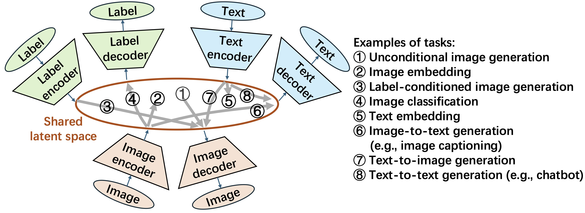
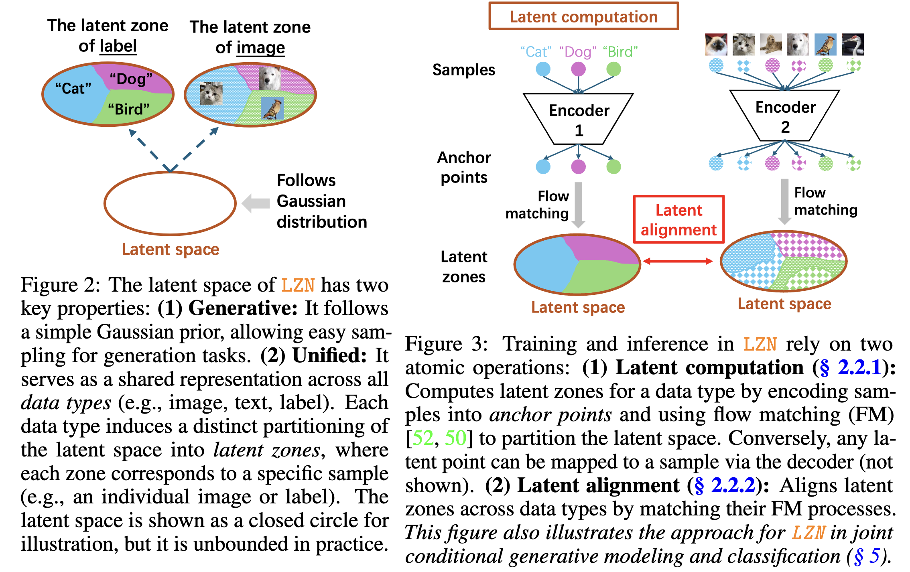
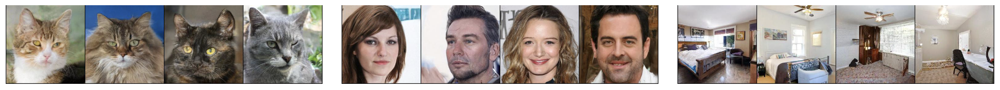

# Latent Zoning Network: A Unified Principle for Generative Modeling, Representation Learning, and Classification

> 👤 **Author:** Zinan Lin  
> 📅 **Date:** September 18, 2025  
> 📄 **Paper (NeurIPS 2025):** [Link to paper](https://arxiv.org/abs/2509.15591)  
> 💻 **Code:** [Link to code](https://github.com/microsoft/latent-zoning-networks)  
> 🧠 **Models:** [Link to models](https://huggingface.co/microsoft/latent-zoning-networks)  
> 🌐 **Website:** [Link to website](https://zinanlin.me/blogs/latent_zoning_networks.html#post)

The machine learning landscape has seen remarkable advances in **generative modeling** (e.g., [OpenAI's DALL·E](https://openai.com/research/dall-e) for image generation and [ChatGPT](https://openai.com/chatgpt) for text generation), **representation learning** (e.g., [OpenAI's CLIP](https://openai.com/research/clip) for text and image representation), and **classification** (e.g., [ResNet](https://arxiv.org/abs/1512.03385) for image classification). Yet each of these tasks typically relies on *separate* methods and training objectives.  

This raises a natural question: **Can one framework unify all three?** Part of our motivation comes from *Occam’s Razor*, which favors simpler solutions whenever possible. More importantly, although these tasks differ in formulation, they share a common goal—extracting patterns from data—and can therefore potentially benefit from one another; a unified principle could facilitate such synergy.

[Our NeurIPS 2025 paper](https://arxiv.org/abs/2509.15591) introduces the **Latent Zoning Network (LZN)** as a step toward this goal. It proposes a *single shared latent space* that naturally integrates these tasks into one unified framework.

Early experiments highlight the potential of this approach: LZN improves **image generation** quality over state-of-the-art [diffusion models](https://arxiv.org/abs/2209.03003), outperforms seminal **unsupervised representation learning** methods like [MoCo](https://arxiv.org/abs/1911.05722) and [SimCLR](https://arxiv.org/abs/2002.05709) on [ImageNet](https://www.image-net.org/), and achieves competitive **classification** accuracy on [CIFAR-10](https://www.cs.toronto.edu/~kriz/cifar.html)—all within a single framework. These results point toward a future where one framework can seamlessly handle multiple core ML tasks.


## The Core Idea: A Shared Latent Space with Zones




LZN builds a **shared Gaussian latent space** where each data type—images, labels, text—has its own *encoder* (to map samples to the latent space) and *decoder* (to map latents back to samples). The latent space in whole follows the standard Gaussian distribution.

ML tasks then become **translations** across encoders and decoders, for example:
- Unconditional image generation = `latent (drawn from Gaussian) → image decoder`
- Conditional image generation = `label → label encoder → image decoder`
- Image classification = `image → image encoder → label decoder`  
- Image representation = `image → image encoder`

More examples in the figure above.  

### Technical Details

To realize the above vision, LZN’s latent space must satisfy two key requirements:  
(1) **Generative:** It should follow a Gaussian distribution, enabling straightforward sampling for generation tasks; and  
(2) **Unified:** Different encoder–decoder pairs should align so that, for example, an image and a textual description of a dog map to similar latent representations.

While these requirements may seem straightforward, they are more challenging to achieve than they appear. Existing techniques are not applicable in several ways:
* **Generative models** such as [variational autoencoders (VAEs)](https://arxiv.org/abs/1312.6114) and [diffusion models](https://arxiv.org/abs/2006.11239) can be viewed as `image encoder + Gaussian latent + image decoder`. However, they lack a principled mechanism to incorporate additional encoder–decoder pairs and align them jointly. In addition, when more conditions (e.g., text, labels) are added, these models typically introduce conditional inputs to the decoder rather than integrating the information into a unified Gaussian latent space.
* **Representation learning** approaches such as [MoCo](https://arxiv.org/abs/1911.05722) and [SimCLR](https://arxiv.org/abs/2002.05709) can be viewed as `image encoder + latent`. However, they impose no distributional constraints on the latent space, making it difficult to extend them naturally for generative tasks.

To address these limitations, LZN takes a fundamentally different and new approach. We construct a mapping such that data samples, after passing through the encoder, partition the latent space into *zones*, with each zone corresponding to a distinct sample. Moreover, we align zones from different encoders—for example, ensuring that the latent zone for a *dog image* is fully contained within the latent zone for the *"dog" label*. Please see [our paper](https://arxiv.org/abs/2509.15591) for more details!




### Connections to Alternatives

The vision of unifying machine learning within a single model has been explored in the community for some time. A prominent example is **auto-regressive (AR) transformers**, including **multimodal large language models**. These models unify *generation* tasks by representing all data as sequences of tokens and modeling them in an AR manner. *Classification* tasks are cast as generation problems—for instance, prompting the model to complete the sentence "Which animal is in this image?". Additionally, prior work has shown that the intermediate outputs in these models can serve as strong *representation* for downstream tasks.

As such, this approach is *generation-centric*: the core formulation remains a generative modeling problem. Tasks that can be framed as generation--such as classification-can be unified naturally. However, for other tasks like representation learning, this approach must rely on surrogate methods, such as using intermediate model outputs. In contrast, *LZN offers a new formulation that seamlessly unifies all these tasks within a single framework*.


**More importantly, AR transformers (and other generative models) should be seen as orthogonal and complementary to LZN, rather than as competitors.** In particular, LZN decoders that map latents to data samples can be instantiated using any generative model (as we will demonstrate in the experiments). This allows LZN to leverage the strengths of existing generative models within its unified framework.

## Key Results

While the framework is general, this work focuses on the *image* domain. We present three case studies: (1) generation, (2) unsupervised representation learning, and (3) joint classification and generation. These case studies are arranged in order of increasing complexity: the first enhances a single task on top of existing objectives, the second solves a task using only LZN *without* any external objectives, and the third tackles *multiple* tasks simultaneously within the same framework.

- **Enhancing generative models.** Incorporating LZN latents into a state-of-the-art [Rectified Flow](https://arxiv.org/abs/2209.03003) model improves image quality **without modifying its loss function**:
    - On CIFAR-10, FID improves from **2.76 → 2.59**, closing **59% of the gap** between unconditional and conditional generation.
    - On high-resolution (256×256) datasets such as AFHQ-Cat, CelebA-HQ, and LSUN-Bedroom, LZN similarly improves generation quality.  
    

- **Unsupervised representation learning.** LZN learns representations that outperform several seminal contrastive learning methods:  
    - On ImageNet, linear classification accuracy on top of LZN representations outperforms **MoCo by 9.3%** and **SimCLR by 0.2%** using the same ResNet-50 backbone.

- **Joint generation and classification.** With image and label encoders/decoders, LZN jointly performs **class-conditional generation** and **classification**:
    - Achieves **better FID** than conditional [Rectified Flow](https://arxiv.org/abs/2209.03003).
    - Matches **state-of-the-art classification accuracy** on CIFAR-10.
    - Crucially, training both tasks *together* improves both performance metrics, supporting the idea that a shared latent space enables **positive transfer across tasks**.

Please see [our paper](https://arxiv.org/abs/2509.15591) for more implementation details and results.

## Limitations and Future Directions

* **Pure generative modeling.** While LZN is fundamentally capable of generative modeling without any auxiliary losses (see [Appendix G](https://arxiv.org/abs/2509.15591)), we only demonstrate how it can enhance existing generative models. Exploring how to fully leverage LZN for standalone generative modeling remains an open direction for future work. We will soon have an update on it. Please stay tuned!
* **Multi-modality and multi-tasks.** In this paper, we focus primarily on image-based applications and at most two tasks simultaneously. However, LZN is designed to be extensible: by incorporating additional encoders and decoders, it can naturally support more modalities and perform multiple tasks concurrently. We leave this exploration to future work.

## Links

* **Paper (NeurIPS 2025):** [https://arxiv.org/abs/2509.15591](https://arxiv.org/abs/2509.15591)
* **Code:** [https://github.com/microsoft/latent-zoning-networks](https://github.com/microsoft/latent-zoning-networks)
* **Models:** [https://huggingface.co/microsoft/latent-zoning-networks](https://huggingface.co/microsoft/latent-zoning-networks)
* **Website:** [https://zinanlin.me/blogs/latent_zoning_networks.html](https://zinanlin.me/blogs/latent_zoning_networks.html)
* **BibTex**:
```bibtex
@article{lin2025latent,
  title={Latent Zoning Network: A Unified Principle for Generative Modeling, Representation Learning, and Classification},
  author={Lin, Zinan and Liu, Enshu and Ning, Xuefei and Zhu, Junyi and Wang, Wenyu and Yekhanin, Sergey},
  journal={arXiv preprint arXiv:2509.15591},
  year={2025}
}
```
